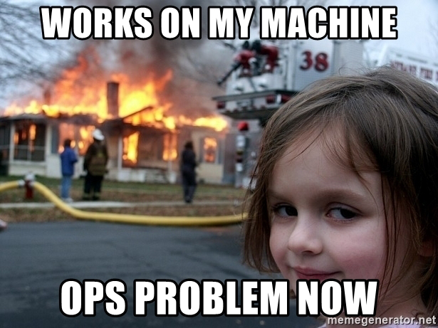
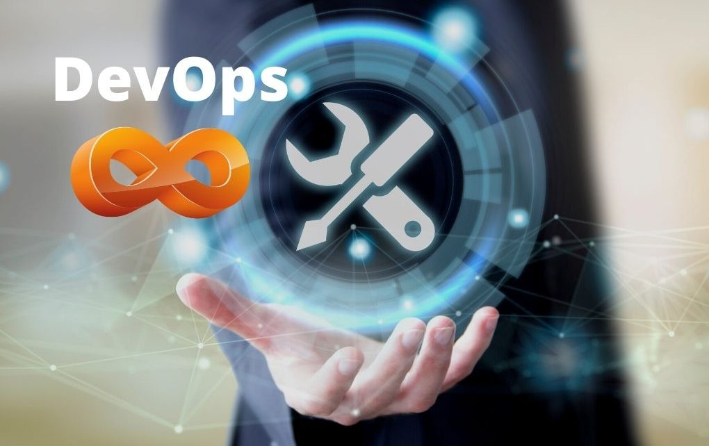
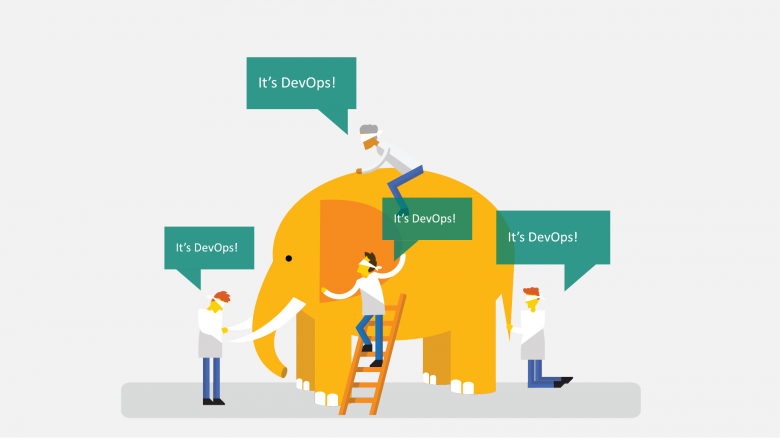
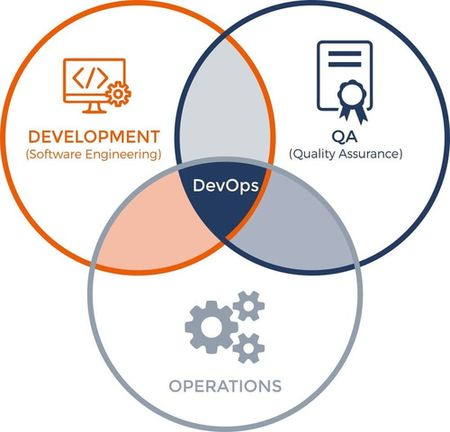
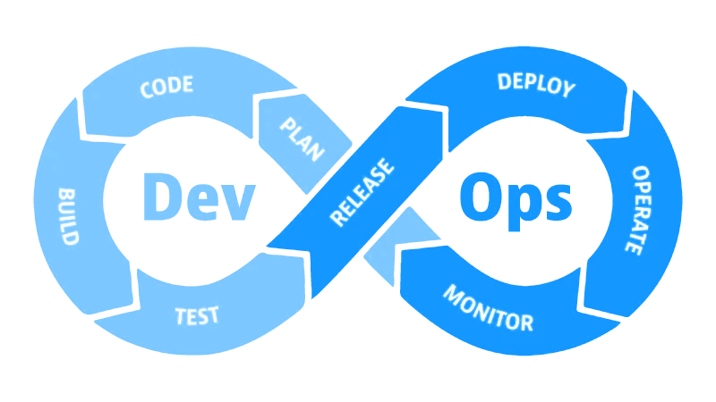
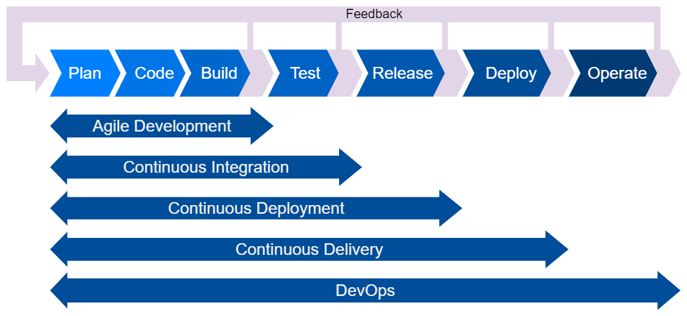
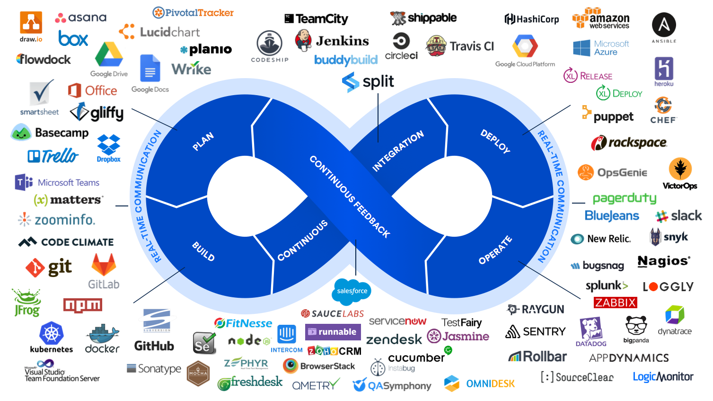

# Roadmap

01. Introduction
02. Software 👈
03. Infrastructure
04. Before DevOps
05. Version Control
06. What is DevOps
07. Infrastructure as Code

## Roadmap (continue)

08. Configuration Management
09. Containerization
10. Orchestration
11. Continuous Integration
12. Continuos Deployment
13. Continuous Delivery
14. The End

# ACME company

Let's look at a fictional eCommerce company, ACME.

- ACME is an online retailer for all kinds of electronic products.
- They sell online at [acme.com](http://acme.com).
- This website is basically a web application which is developed in-house by their IT team.
- There is a lot of work which goes into creating and maintaining this web application.

# ACME Teams

- Management
- development team
- Build & Integration team
- Operations team
- QA

# ACME Teams → Management Team

Management team sets the functional roadmap of the product by doing market research and customer surveys.

They come up with requests for new functionalities or modification of existing functionalities.

<!-- They interact closely with the software development team. -->

## ACME Teams → Development Team

The _Development Team_ team takes inputs from the product management and works on implementing the requested features.

The code is maintained in a source code repository.

<!--
  All the code is maintained in a source code repository.
  Git is a source code versioning system that has gained universal acceptance in the last decade or so.
  It has various features like versioning, branching, tagging, etc.
-->

## ACME Teams → QA Team

Quality Assurance team tests the software for defects and make sure the features work as expected.

Any defects found are reported back to the programmers.
If no defects are found then it gives a go-ahead to operations team.

<!--
Then the whole process is repeated....
First by fixing the code, then integrating it, building it and creating a new package, and then redeploying it.

Once Quality Assurance gives a go-ahead, the operations team takes the latest release package, follows the instructions given to them by the developers, and deploys it into production.
-->

## ACME Teams → Operations Team

This package is then passed on, along with some instructions, to the Operations team who deploy it on to a test/prod environment.

They monitor logs periodically to determine issues and their root causes.

## ACME Teams → Build & Integration Team

There is also a Build & Integration team which
- integrates the code from all the programmers
- compiles the code, and build a software package (e.g. releases)
- integrates new tools (new versions of toolchains, static code analysis, etc.)

# Pain points 🤦‍♂️

<!--
This was how software development used to happen for the last 5 to 10 years, before Continuous Integration, Continuous Delivery, and DevOps came in.

Lets identify some of the pain points in this old school way of software development.
-->

- Silos
- No point of truth
- Different build/runtime environments
- No automatic tests
- Late integration
- Technical Debt
- Long feedback loop

# Silos

Silos are _separate teams_ that have "walls" in between them:

- different teams
- no communication
- different management
- no shared goals

# Silos → No responsibility

Each team is responsible only for own part of jobs. There is no desire to resolve issues of other team.

<!--
Traditional Silos:

- Dev
- Build
- QA
- OPS

Silos interplay 🤡

# Silos interplay

CODE

We've got a few teams here.
So let's see what happens here...

Intro.

The problem now here is that every group has its own domain expertise and that domain expertise cannot be seen over the wall.

Dev and Ops teams are some like a black box to each other.
That means they have no visibility into each other's domain expertise.
Developers do not really have much visibility into the production system, and the ops has very little visibility into the code.

It may also lead to fire fighting or finger pointing where the groups will claim that it's not their responsibility.

Act 1.

Developers will create some code.

Code goes to build team. Somebody should fix build errors. In most cases, this is Build team.

If troubles go beyond just minor syntax errors, then code goes back to developers. Developers finally fix code and build has been done.
[Working on my machine]

Act 2.

"Code" just bumps over the wall for the QA to test.
At this point, the developers are considering themselves to be no longer responsible for it.
QA team found a problem with the code.
There may be a series of bug fixes and the code bounces back and forth between Dev, Build and QA teams
Developers start new tests, WTF, now they should back to old tasks.

until the QA team finally says that: Okay, the code is good, There are no problems.
So now the QA team is finished with the code.
So they throw it over the wall to the operations team now.

Act 3.

So now code should go to production.
The code probably might have introduced some kind of a bug in the production, or there may be several reasons why the code cannot be deployed in production:
- customer switched to another version of a library/framework
- production environment differs from staging and new issues are appeared.

  The ops team will say, hey, the systems are working absolutely fine.
  It's your code that has the problem.
  But the dev team says: hey, it's not my problem. Because the code works absolutely fine on my machine.
  And they don't know why it's not working on the production because they have no visibility into the production system.
  And the OPS team simply assumes that the developers must be the key source of the problem.

The operations team throws the code back over the wall to the dev team.

Занавес!
Кто участвовал в таком цирке? 🤡
-->

# Silos → No trust

Teams do not really trust each other. They both think that the problem is caused by the other team. (It's easy to think so.)

When the teams meet in a cafeteria, they think that:
- Ops: these are the guys who are responsible for breaking stability because they are shipping the code too often. And every time they ship the code, they introduce problems into the production.
- Dev: these guys do not absorb my code. They do not put in the code in the production. They are the obstacles.

<!--
So they turn against each other and make them enemies.

  When the Ops and the dev team probably meet in a cafeteria for a coffee or something, they think that:
  > hey, these are the guys who are responsible for breaking stability because they are shipping the code too often. And every time the ship the code, they introduce problems into the production.
  And when the dev team looks at the operations team, they think that:
  > hey, these guys do not absorb my code. They do not put in the code in the production.
  They are the obstacles. So they do not look at the ops team. As the same team there, in their view ops team, as the obstacles to get the job done.
-->

#

# Silos → Different goals

Dev team:
  - Goal: Deliver features quickly
  - KPI: Speed and feature metrics

Ops team:
  - Goal: Maintain stability
  - KPI: Stability metrics

<!--
Even if the two teams want to work together, the dev team and the ops team really can't work together because their goals and deliverables are different.

The goal of the development team is to deliver features into the hands of the customers as quickly as possible. So the goal is speed.
Now for the development team to deliver features into the customer's hands, they have to deploy changes and those changes introduce a risk of instability.

But the goal of the operations team is to maintain the stability of the system and also to minimize the downtime.
The operations team does not like dev team because developers is trying to deploy as many changes as possible.

The goals of the development team and the goals of the operations team become an opposition to one another in a traditional model.

In fact, both the teams have sudden KPI (key performance indicators).
For the development team, the speed of delivery is a KPI,
whereas operations teams are measured according to their minimized downtime hours.

Есть ли KPI у тестировщиков?

So they have a great incentive to fight against each other, to be in opposition to one another.

Now, both speed and stability are very important goals, but the development and ops team are in opposition to one another.
So neither of the teams are able to accomplish their goals properly.
 -->

# No point of truth

- Teams don't use a version control system, or
- Teams have independent set of repositories
- Some artifacts (e.g. docs, handy scripts) are not under version control

<!--
Возможное решение: use Git for almost all, даже для documents
Но нужно понимать, как он работает.
Бинарники в Git?
-->

# Different build/runtime environments

Every person installs favorite OS, tools, packages.

Different versions may lead to different consequences:

- compilation errors/warnings
- runtime results
- incompatibility issues

Customer may have own environment 🙄

<!--
Возможное решение:
using DK, central repositories
-->

# No automatic tests

<!-- Missing autotests leads to: -->

- many regressions
- poor software quality
- easy to break code
- manual testing is
  - too slow
  - not consistent
  - not enough to cover code mostly

😱 Some developers think that tests should be written by testers exclusively

<!--
> Automatic tests requires much efforts to be done.
> There is no time to create autotests ⌛. It is too long.
> A release should be ready "yesterday".

автотестами должны заниматься разработчики (?)

Возможное решение:
убедить менеджмент и заказчика, что так эффективнее в долгосрочном плане.
Писать самому, но покрывать сперва самое необходимое. Проблема "бутылочного горлышка" при тестировании кода.
-->

# Late integration

Integration is painful process:

- who will do integration
- take changes from customers
- sync repositories
  - get updates for 3rd party code
  - update upstreams
- fix compilation errors/warnings
  - fix broken (or comment 😂) autotests
- fear of merge conflicts

<!--

# Кто будет интегрировать?

- Когда говорят про частую интеграцию, это может породить проблему, что код в мастере не собирается.
- Когда нет code review это приводит к хаосу в master

Each module is assigned a different branch under the source control repository.
This is done to reduce inter-module dependencies, so that there is no stepping on each other's foot.
But at some point, the code for all of these modules have to be integrated into a single unit before it can be deployed on to a server.

- интеграцией кода должны заниматься разработчики, а не Ops

- интеграцией систем занимаются Ops (?)
This is what the Build & Integration team does.
After each iteration, the Build and Integration team merges the code from each module branch into a single mainline branch, often called the master branch.
They make sure the code compiles, and then build a deployable software package out of it, which is then passed on to the operations team.

# Late integration

Перед интеграцией надо забрать изменения от заказчика.
- different repositories (e.g. on customer and developer side)
А если оборудование после апдейтов перестаёт работать?!

Когда интеграция происходит в самом конце, то никто не учитывал изменения других. Все работали с базовой версией. А интеграция она проходит очень болезненно.
- Куча ошибок компиляции
- Тесты валятся, если они есть.
- Времени фиксить нету, релиз надо было сдавать "вчера".

3rdparty надо тоже к себе интегрировать, чтобы использовать новую функциональность.
- not only own code, but 3rd party as well

- Google has only (huge) one repository (?)
  TODO: add fact to big picture
- Fear of merge conflicts
-->

<!--
# Legacy code

- Deprecated code
- Changes of infrastructure
- Lost knowledge
-->

# Technical Debt

[Wikipedia definition](https://en.wikipedia.org/wiki/Technical_debt):

> technical debt is the implied cost of additional rework caused by choosing an easy (limited) solution now instead of using a better approach that would take longer.

Unaddressed technical debt provides less options to build and deliver correct software and increases cost of further rework.

<!--
The more technical debt you have, the less options you have to build and deliver correct solutions. Finally, you end up building workarounds on the top of workarounds, house of cards on house of cards. And it is a matter of time before they all collapse. You already know this.
-->

# Long feedback loop

- Easy forget what was a couple weeks (or longer) ago
- Hard to find a version sent to customer
- All current time dedicated to new features and tasks

<!--
At this point, the new features are available on the website, acme.com.

Each iteration since code changes to production deployment takes too much time (from a couple weeks to months).

или

This whole cycle can last anywhere from a couple of weeks to a couple of months. One such cycle is called an iteration.
-->

# Consequences

<!-- - ugly code 💩 -->
- inefficiency 🐢
  - protracted process of deploying code to the production
  - manual things are slow and inconsistent
- customer dissatisfaction 👎
- project failure 💀

<!--
in an IT organization Both the dev team and the ops team are in the business of shipping something to the customer shipping: code or shipping an application.

So what are the consequences of all this?
the traditional silo model is leading to a protracted process of deploying code to the production.
The protracted process means a slow time to market.

That means the development team cannot get the code to the customers quickly and efficiently.

All of this is because a lot of things that are manual in nature, things are not automated and the built in deployments are totally inconsistent.

For example, if the deployments are performed manually, the way in which the deployment occurs may depend on which operations engineer happens to be on call when the deployment happens.
So different people are going to do things different ways, or even the same person may not do it the same way today that they did yesterday.
This inconsistency is a major source of problems in production.

And because neither team has visibility into other team's domain, they are spending a lot of time finger pointing and it takes longer than it needs to identify and fix problems.
So we can see that ultimately the traditional silo model is bad for both speed of delivery and stability.
-->

# Heard about DevOps?

ACME's employees:
- heard about DevOps
- want to apply DevOps
- and get improvements to their development process and IT systems

#

#

🤔 What is DevOps?

# What is DevOps?

Term DevOps short for development plus operations and lot of people define devolves in different ways:

- "DevOps is development and operations collaboration"
- "DevOps is using automation"
- "DevOps is small developments"
- "DevOps is treating your infrastructure as code"
- "Kanban for Ops?"
- "DevOps is feature switches"

<!--
Feature flags (called feature toggles by some) are a software development and delivery technique that allows software teams to enable and disable parts of a codebase at the flip of a switch. Feature flags enable software teams to adopt DevOps practices, in so much as they help increase deployment speeds, system stability, and cross-team collaboration.
https://launchdarkly.com/blog/feature-flags-toggles-in-devops-how-these-concepts-relate/
-->

#

# DevOps → Inception

- In 1993 the Telecommunications Information Networking Architecture Consortium (TINA-C) defined a Model of a Service Lifecycle that combined software development with (telecom) service operations.

- In 2009, the first conference named `devopsdays` was held in Ghent, Belgium. The conference was founded by Belgian consultant, project manager and agile practitioner Patrick Debois. The conference has now spread to other countries.

- In 2012, the State of DevOps report was conceived and launched by Alanna Brown at Puppet.

## DevOps → Inception (continue)

- As of 2014, the annual State of DevOps report was published by Nicole Forsgren, Gene Kim, Jez Humble and others. They stated that the adoption of DevOps was accelerating. Also in 2014, Lisa Crispin and Janet Gregory wrote the book More Agile Testing, containing a chapter on testing and DevOps.

- In 2016 the DORA metrics for throughput (deployment frequency, lead time for changes), and stability (mean time to recover, change failure rate) were published in the State of DevOps report.

# What is DevOps?

[Wikipedia definition](https://en.wikipedia.org/wiki/DevOps):

> DevOps is a set of practices that combines software development (Dev) and IT operations (Ops). It aims to shorten the systems development life cycle and provide continuous delivery with high software quality.

<!--
Now the DevOps aims at shorten development cycles.
That also means that you're increasing the deployment frequency and more dependable releases in close alignment with business objectives.
-->

Bass; Weber; Zhu (2015). DevOps: A Software Architect's Perspective. ISBN 978-0134049847:

> DevOps is a set of practices intended to reduce the time between committing a change to a system and the change being placed into normal production, while ensuring high quality".

<!--
DevOps Academy definition:

> DevOps is a process to develop, deliver and operate Software.
-->

However, the term is used in multiple contexts. At its most successful, **DevOps is a combination of specific practices, culture change, and tools**.

# DevOps is a team work

> _Devops isn't any single person's job. It's everyone's job._
>
> Christophe Capel
> Principal Product Manager, Jira Service Desk

Even the term DevOps is coined from Development and Operations, other teams also may participate in DevOps.

#

<!--
разработка, тестирование, эксплуатация

Иногда это:
- Scrum реализует Agile
- Scrum использует мультифункциональные команды
- Это стирает различия между обязанностями
-->

# DevOps Goals

🎯 The primary DevOps goal is to optimize the flow of value from idea to end user.
<!-- make the delivery of value more efficient and effective. -->

- Improve the frequency of deployments / Decrease time to market
- Reduce production failures rates
- Shorten mean time to recovery
<!-- - Unify Dev & Ops Teams -->

<!--
Конкретные цели DevOps охватывают весь процесс поставки программного обеспечения. Они включают:
- Сокращение времени для выхода на рынок;
- Снижение частоты отказов новых релизов;
- Сокращение времени выполнения исправлений;
- Уменьшение количества времени на восстановления (в случае сбоя новой версии или иного отключения текущей системы).

## Reduce production failures rates

Направлено на стабильность.
- разработчикам сложнее налажать, чтобы сломать master - системы CI делают проверки там, где можно.

## Improve the frequency of deployments / Decrease time to market

Направлено на скорость.
Everybody wants products to be delivered quickly.

Тут важно различать:
- скорость выпуска релизов и это связано с моделью разработки и её параметрами (например, длиной спринтов)
  - тут Agile играет важную роль, поскольку изменения выкатываются раз в N недель
    - It is flexible to the customer's needs and demands.
- скорость выкатки изменений в prod
  - focus on getting small pieces of functionality in front of the customer as quickly as possible.
  - в книжках можно найти приятные таблицы и картинки, что можно делать 100500 выкаток в день, но правда в том, что если техническая возможность позволяет это достичь, то скорость разработчиков не настолько велика.

Заказчик счастлив.

## Shorten mean time to recovery

Направлено на стабильность.
Иногда по собственной ошибке, иногда в силу форс-мажора что-то ломаем.
Иногда бывает нужно переехать к другому поставщику услуг.
И тут всё ломается и не работает.

## Unify Dev & Ops Teams

So when we think about traditional models, it's always these two teams working independently.

But let's take a look at how the DevOps culture fits in here.

1) break down silos
2) create cross-functional teams

The dev and ops team are one group.
They got shared goals and shared key performance indicators.
Both speed and stability are very important.
They prioritize speed and stability equally.
So all the members of the team get together to find solutions.
Developers care about stability as well. And the ops guys care about speed.
-->

# What is Best Practice?

As you can read in [Wikipedia](https://en.wikipedia.org/wiki/DevOps):

> A best practice is a method or technique that has been generally accepted as superior to any alternatives because it produces results that are superior to those achieved by other means or because it has become a standard way of doing things.

<!--
Лучшая практика - это метод или техника, которые общепризнанно превосходят любые альтернативы, потому что они дают результаты, превосходящие результаты, достигнутые другими способами, или потому, что они стали стандартным способом ведения дел.
-->

# DevOps Practices 🌟

- Agile project management
- Using version control
- Infrastructure as code
- Test automation (Continuous testing)
- Continuous integration
- Continuous delivery
- Continuous deployment
- Monitoring System and Application Health (Continuous monitoring)

# Continuous _everything_ 🔁

The concept of continuous _everything_ embraces continuous or iterative software development, meaning that all the development work is divided into small portions for better and faster production.

<!-- Engineers commit code in small chunks multiple times a day for it to be easily tested. -->

DevOps practices reflect the idea of continuous improvement and automation. Thus _continuous_ term is involved into title.

# Agile project management

DevOps is complementary with Agile software development. Actually, several DevOps aspects came from the Agile methodology:

- Agile planning organizes work in short iterations
- The team focuses on delivering work in smaller increments
- Requirements, plans, and results are evaluated continuously

Delivery of value to their customers is faster and with fewer headaches.
<!-- - Delivery and deployment are not always possible but bring a lot benefits -->

<!--
то же, но другими словами
In contrast to traditional approaches of project management, Agile planning organizes work in short iterations (e.g. sprints) to increase the number of releases.

Agile teams focus on delivering work in smaller increments, instead of waiting for a single massive release date. Requirements, plans, and results are evaluated continuously, allowing teams to respond to feedback and pivot as necessary.

That helps teams deliver value to their customers faster and with fewer headaches.

- можно разрабатывать хорошо, а поставлять - тут сильно зависит от области
  - встраиваемое ПО нельзя выкатывать на раз-два
  - заказчик может иметь свои стенды, свои процессы и мы туда не влезем
- НО если мы можем поставлять и следить за этим - это даёт большое преимущество
  - автоматически, без людей (но с подтверждением)
  - следить за ошибками
  - снимать метрики
-->

# Using Version Control

Both Dev and Ops should use version control for everything.

They should share the same _single source of truth_ for:

- code
- documentation
- tests
- infrastructure
- artifacts

# Infrastructure as code

- **Infrastructure as code** (IaC) is a practice in which infrastructure is provisioned and managed using code and software development techniques, such as version control and continuous integration.

- The cloud’s API-driven model enables to interact with infrastructure programmatically, and at scale, instead of needing to manually set up and configure resources.

- Infrastructure and servers can quickly be deployed using standardized patterns, updated with the latest patches and versions, or duplicated in repeatable ways.

<!--
Инфраструктура как код – это практика, в которой выделение инфраструктуры и управление ею происходит с помощью кода и методов разработки ПО, таких как управление версиями и непрерывная интеграция.

Облачная модель на основе API позволяет разработчикам и системным администраторам взаимодействовать с инфраструктурой на программном уровне при любом масштабе, вместо того чтобы устанавливать и настраивать ресурсы вручную.

Таким образом, инженеры могут работать с инфраструктурой с помощью средств на основе кода так же, как они работают с кодом приложения. Поскольку инфраструктура и серверы определяются кодом, их можно быстро развернуть с использованием стандартных моделей, установить на них последние исправления и версии или дублировать одинаковым способом.

Применимы практики разработчиков:
- ревью
  - повысить качество и повысить знакомство с кодом
    Use peer reviews for better quality; leverage your team’s familiarity,
- тестирование
Контроль: предсказуемость и повторяемость
-->

# Test automation

- **Test automation** ensures software works as expected.

- It requires the use of automation frameworks and tools to write test scripts.

- Test automation decreases the amount of human intervention in the testing process.

- This step keeps things in an always-deployable state.
<!--
Этот шаг сохраняет все в состоянии готовности к постоянному развертыванию.

Пример: можно исправлять изменения в master, а можно проверить всё до интеграции в master

! Подкрывать тестами скрипты для инфраструктуры! Это часто упускается.
-->

# Continuous integration

- **Continuous integration** (CI) is a software development practice where developers regularly merge their code changes into a central repository, after which automated builds and tests are run.

- The key goals of continuous integration are to find and address bugs quicker, improve software quality, and reduce the time it takes to validate and release new software updates.

<!--
Непрерывная интеграция – это практика разработки ПО, при которой разработчики регулярно объединяют изменения программного кода в центральном репозитории, после чего автоматически выполняется сборка и тестирование. Главная задача непрерывной интеграции – быстрее находить и исправлять ошибки, улучшать качество ПО и сокращать временные затраты на проверку и выпуск новых обновлений ПО.
-->

# Continuous delivery

- **Continuous delivery** (CD) is a software development practice where code changes are automatically built, tested, and prepared for a release to production.
<!--
- It expands upon continuous integration by deploying all code changes to a testing environment after the build stage.
-->

- An staff member might then decide to promote such code changes into production.

- Project will always have a deployment-ready build artifact that has passed through a standardized test process.

<!--
Непрерывная доставка – это практика разработки программного обеспечения, когда при любых изменениях в программном коде выполняется автоматическая сборка, тестирование и подготовка к окончательному выпуску. Непрерывная доставка расширяет практику непрерывной интеграции за счет того, что все изменения кода после стадии сборки развертываются в тестовой и (или) в рабочей среде. При правильном внедрении непрерывной доставки у разработчиков всегда есть готовый к развертыванию собранный экземпляр ПО, прошедший стандартизированную процедуру тестирования.
-->

# Continuous deployment

- **Continuous deployment** (CD) practice automates the release of new or changed code into production.

- A project might release code or feature changes several times per day.

- Container technologies help to maintain consistency of the code across different deployment platforms and environments.

# Monitoring System and Application Health

- **Monitoring system and application health** is practice when organizations monitor both the code in operation and the underlying infrastructure that supports it.

- Metrics and logs help to see how application and infrastructure performance impacts the experience of their product’s end user.

- A feedback loop that reports on bugs or issues then makes its way back to development.

# DevOps Loop

# Solution Delivery Pipeline

## Solution Delivery Pipeline (continue)

- The lean, XP, and manufacturing production line ideas (coupled with tools being used today) are pushing us toward product development as a factory production line.

<!--
Some XP (eXtreme Programming) and Lean Manufacturing Principles:
- Small Releases
- Continuous Integration
- Collective Ownership
- Deliver as fast as possible
- Quality at every step
- See the whole
-->

- As DevOps is intended to be a cross-functional mode of working, those who practice the methodology use different sets of tools - referred to as "toolchains" - rather than a single one.

- Toolchains can automatically flow chunks of code from environment to environment. This leads to small releases that are tested at each step that are frequently and quickly delivered for deployment.

# DevOps Tools

There are plenty of DevOps tools for different purposes.

One tool may be used on different stages of development cycle.

Each company use set of tools suitable for it.

You may find a lot of examples of tools in [Periodic Table of DevOps Tools](https://digital.ai/periodic-table-of-devops-tools).

# Toolchains Categories

These toolchains are expected to fit into one or more of the following categories, reflective of key aspects of the development and delivery process.

| Category    | Description                                                                        |
| :---------- | :--------------------------------------------------------------------------------- |
| Coding      | code development and review, source code management tools, code merging.           |
| Building    | continuous integration tools, build status.                                        |
| Testing     | continuous testing tools that provide quick and timely feedback on business risks. |
| Packaging   | artifact repository, application pre-deployment staging.                           |
| Releasing   | change management, release approvals, release automation.                          |
| Configuring | infrastructure configuration and management, infrastructure as code tools.         |
| Monitoring  | applications performance monitoring, end-user experience.                          |

# Toolchains Categories → Coding

- git / GitHub, GitLab, Azure DevOps
- VS Code, IntelliJ IDEA, PyCharm
- etc.

# Toolchains Categories → Building

- gcc, g++, make, CMake
- Gradle, Maven
- Jenkins, Travis CI
- Docker
- etc.

# Toolchains Categories → Testing

- GoogleTest, CppUnit
- JUnit, Mockito
- Selenium
- etc.

# Toolchains Categories → Packaging

- Docker, Podman
- Sonatype NEXUS
- JFrog Artifactory
- etc.

# Toolchains Categories → Configuring

- Terraform
- Ansible, Puppet, Chef
- Kubernetes
- etc.

# Toolchains Categories → Monitoring

- Nagios, Grafana
- Prometheus, ELK
- Splunk, Datadog, Sensu
- Zabbix
- etc.

<!--
#

#

#

#

 -->

#

#

# DevOps Culture

<!--
At its essence, DevOps is a culture, a movement, a philosophy.

Obviously, there’s a cultural change that must happen for a company to be successful with DevOps on collaboration between developers and the operations people. They need to have certain _practices_, certain rules, certain guidelines.

не думал, что буду говорить когда-то о культуре.
культура - то, что мы делаем - само собой разумеющееся.
-->

- While DevOps is made possible by new tools and agile engineering practices, these are not enough to gain the benefits of DevOps.

- Without the right mindset and culture, it’s hard to realize the full promise of DevOps. <!-- Thus the teams need to have certain practices, rules, guidelines, and mindset. -->

- At its essence, a DevOps culture involves closer collaboration and a shared responsibility between development and operations for the products they create and maintain.

- This helps companies align their people, processes, and tools toward a more unified customer focus.

<!-- > Culture (Organizational Culture) - The values and behaviors that contribute to the unique psychosocial environment of an organization. -->

# DevOps Culture → Shared responsibility

- DevOps entails shared responsibilities. Development and operations staff should both be responsible for the success or failure of a product.

- Development adopts a "you build it, you run it" mentality. They test and operate software and collaborate more with QA and IT Ops. When they understand the challenges faced by operations, they are more likely to simplify deployment and maintenance.

- With operations teams more involved in the development process, they can add maintenance requirements and customer needs for a better product, adopt automation tools.

<!--
Developers are expected to do more than just build and hand off to operations — they are expected to share the responsibility of overseeing a product through the entire course of its lifetime, adopting a "you build it, you run it" mentality. They test and operate software and collaborate more with QA and IT Ops. When they understand the challenges faced by operations, they are more likely to simplify deployment and maintenance.
Likewise, when operations understand the system’s business goals, they can work with developers to help define the operational needs of a system and adopt automation tools.
-->

## DevOps Culture → Shared responsibility (continue)

- Both teams are all working together upfront to build a good, robust process. The speed and stability are prioritize equally.

- Blameless post-mortem reports enable to better identify root causes of incidents and discover techniques to avoid same and similar errors in the future and to improve processes.

# DevOps Culture → Autonomous teams

<!-- Autonomous teams are another important aspect of DevOps. -->

For the development and operations teams to collaborate effectively, they need to make decisions and implement changes without a cumbersome and lengthy approval process. This involves handing over trust to teams and establishing an environment where there is no fear of failure. These teams should have the right processes and tools in place to make decisions faster and easier, for each level of risk to the customer.

<!--

For instance, when Devs need to additional hardware resources in a DevOps set up, they should be able to deploy their builds in cloud environments without having to interact with Ops or wait for the necessary approval.

***

For example, a typical development workflow might require engagement from several contributors on different teams to deploy code changes. The developer makes a code change and pushes it to a source control repository, a build engineer builds and deploys the code to a test environment, a product owner updates the status of the work in an issue tracking tool, etc. An autonomous team will take advantage of tools that automate these processes, so that pushing new code triggers the building and deployment of a new feature into a test environment and the issue tracking tool is updated automatically.

For example, a team is handicapped by requirements like having to open a ticket with a separate operations team to make a trivial infrastructure change, such as a new DNS entry. A task that should take seconds to complete ends up taking days or weeks to satisfy. An autonomous team has the ability to implement such changes themselves, whether by having an individual on the team who has the correct skills and experience, or by having access to self-service tooling.

***

For instance, Devs may want to deploy new features quickly in response to end-user feedback and market demands—but the QA team may want to ensure that every release iteration is stable, secure, and performs as per intended standards.
-->

# DevOps Culture → Feedback

DevOps ensures that developers get the fast feedback about the performance and stability of application software in production to rapidly iterate and improve on application code.

<!--
A DevOps team culture values fast feedback that can help with continuous improvement of a unified development and operations team. In an environment where the development and operations teams are in isolated silos, feedback about the performance and stability of application software in production is often slow to make it back to the development team, if it makes it at all. DevOps ensures that developers get the fast feedback they need to rapidly iterate and improve on application code by requiring collaboration between operations folks in designing and implementing application monitoring and reporting strategies. For example, any sufficiently capable continuous integration tool will enable automated build and testing of new code pushes and provide the developer with immediate feedback on the quality of their code.
-->

# DevOps Culture → Automation

Automation is essential to DevOps culture, since it allows great collaboration and frees up resources. Automating and integrating the processes between software development and IT teams helps them to build, test, and release software faster and more reliably.

# Challenges

Implementing CD involves considerable challenges of different kinds:

- Human and Organizational
- Process
- Infrastructure
- Application Architecture
- Testing

[Source](https://arxiv.org/pdf/1812.08939.pdf)

# Challenges → Human and Organizational

- Resistance to change
- Customers don’t want faster releases
- Lack of confidence in the pipeline
- Synchronization

<!--
1) The first challenge is resistance to change by the employee(s) of companies. Release activities involve many divisions of the company. Each has its own interests, ways of working, and perceived territories of control. Tension existed between divisions due to competing goals. For example, we needed root access to the servers, and another team controlled this permission. Arriving at a solution involved much consultation and negotiation over six months.

2) Depending on the type of software, some customers would rather receive a new version of the software three to four times a year than what could be multiple versions in the same day. Customer may not trust the deployment pipeline and is scared of receiving version that are not fully tested. Also, for some industries, it’s easier for the customer to have fewer releases, for example in the military or medical sector, because they cannot account for the adaptation time required for each version.

3) The lack of trust can be observed not only from the customers, but from the developers and managers as well. It is very normal at the beginning of the implementation of Continuous Deployment. There is a lack of confidence in the pipeline (the tools used to run the automated tests and deployment), lack of confidence in the application being developed.

4) Since there is a new version of the application at every commit, it becomes very important to correctly order the feature implementation. For more traditional release rate (e.g. three to four times a year), it doesn’t matter if you push the user interface before the logic of the application because the customers will not have the application until a formal release. This is not the case with CD: for larger teams, where different developers are working on parts of the same feature, organizing which part goes before which and making sure that everything is ready before pushing can be challenging.
-->

# Challenges → Process

- No emphasis on testing
- Split QA and Dev teams
- Security
- Different environments for production and development
- Process based on non-executable models

<!--
Many traditional processes hinder CD. For example, a feature that’s ready for release normally must go through a change advisory board.5 This can delay the release for up to four days. If a feature takes only a few days from conception to being ready for release, this four-day period accounts for too much of the feature’s total cycle time.
-->

# Challenges → Tools

- Tools availability
- Tools compatibility
- Tools configuration

<!--
Technical Challenges
A robust, out-of-the-box, comprehensive, and yet highly customizable solution for CD doesn’t exist yet. So, we developed our own solution, which was costly. Tools that fill this gap will save companies considerable resources. When we’re building the CD platform, we use many different tools and technologies as building blocks. Avoiding vendor lock-in is challenging. Work on developing widely accepted standards, defining open APIs, and building an active plugin ecosystem will help alleviate the challenge.
Dealing with applications that aren’t amenable to CD (for example, large, monolithic applications) is also challenging. A huge number of such applications exist in the industry.
-->

# Challenges → Infrastructure

- Resources to automate
- Competition for resources

# Challenges → Application Architecture

- Software must met a set of architecturally significant requirements (ASRs), such as:
  - deployability
  - modifiability
  - testability
  - monitorability
- Highly coupled monolithic architecture deployment is complex
- Testing monolithic application
- Refactoring monolithic to micro-service is near impossible
- External resources increase chance of errors or delays

<!-- These ASRs require a high priority and cannot be traded off lightly. -->

# Challenges → Testing

- Testing non-functional features
- Increase testing time
- Flaky tests

# DevOps Benefits

- Accelerated Time to Market
- Building the Right Product
- Improved Productivity and Efficiency
- Reliable Releases
- Improved Product Quality
- Improved Customer Satisfaction

<!--
## Accelerated Time to Market

CD lets us deliver the business value inherent in new software releases to our customers more quickly. This capability helps the company stay a step ahead of the competition, in today’s competitive economic environment.

## Building the Right Product

Frequent releases let the application development teams obtain user feedback more quickly. This lets them work on only the useful features. If they find that a feature isn’t useful, they spend no further effort on it. This helps them build the right product.

## Improved Productivity and Efficiency

For example, developers used to spend 20 percent of their time setting up and fixing their test environments. Now, the CD pipeline automatically sets up the environments. Similarly, testers used to spend considerable effort setting up their test environments. Now, they don’t need to do this, either.

Operations engineers used to take a few days’ effort to release an application to production. Now, they only need to click a button; the pipeline automatically releases the application to production. Furthermore, developers and operations engineers used to spend much effort on troubleshooting and fixing issues caused by the old release practice. The CD pipeline eliminated these issues. The effort that otherwise would have been spent fixing these issues can be used for more valuable activities.

## Reliable Releases

The risks associated with a release have significantly decreased, and the release process has become more reliable. As we mentioned before, with CD, the deployment process and scripts are tested repeatedly before deployment to production. So, most errors in the deployment process and scripts have already been discovered. With more frequent releases, the number of code changes in each release decreases. This makes finding and fixing any problems that do occur easier, reducing the time in which they have an impact. Moreover, the CD pipeline can automatically roll back a release if it fails. This further reduces the risk of a release failure.

The engineers commented that they don’t feel the same level of stress on the release day that they did previously. That day becomes just another normal day.

## Improved Product Quality

Product quality has improved significantly. The number of open bugs for the applications has decreased significantly. With CD, immediately after a code commit, the whole code base undergoes a series of tests. If the tests find a problem, the developers fix it before moving to another task. This eliminates many bugs that otherwise would have been open in the bug-tracking system with the old release practice.

## Improved Customer Satisfaction

Before moving to CD, distrust and tension existed between the users’ department and the software development teams, owing to quality and release issues.
-->

